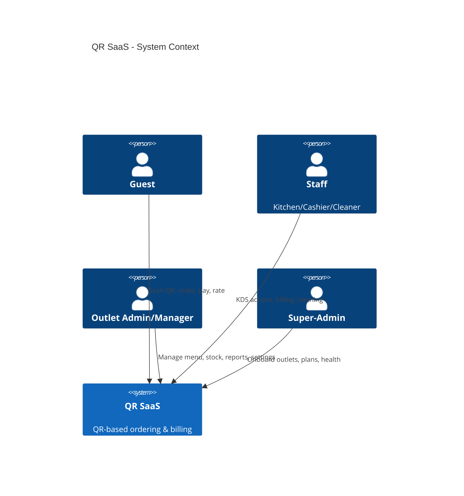

# Architecture (C4) — System & Container Views

## System Context (Mermaid)


## Container View (Mermaid)
```mermaid
C4Container
title QR SaaS - Container Diagram
System_Boundary(s, "QR SaaS"){
  Container(api, "API (FastAPI)", "Python", "Auth, orders, invoices, sync")
  Container(pwa, "PWA (Guest/Staff)", "React/Tailwind", "Guest + KDS + Admin UI")
  ContainerDb(pg_master, "Postgres Master", "DB", "Outlets/subscriptions/audit master")
  ContainerDb(pg_tenant, "Postgres Tenant(s)", "DB", "Per-outlet data")
  Container(redis, "Redis", "Cache/MQ", "Sessions, pubsub, outbox")
  Container(obj, "MinIO/S3", "Object Store", "Photos, PDFs")
  Container(reverse, "Caddy/Traefik", "Proxy/TLS", "Domains/SSL")
  Container(worker, "Worker", "Python", "Alerts, EMA, sync")
}
Rel(guest, pwa, "HTTPS")
Rel(pwa, api, "JSON/WS/SSE")
Rel(api, pg_master, "SQL")
Rel(api, pg_tenant, "SQL")
Rel(api, redis, "Redis")
Rel(api, obj, "S3 API")
Rel(api, worker, "Events")
Rel(worker, redis, "Pub/Sub")
Rel(guest, reverse, "HTTPS", "Custom domain/subdomain")
```

## Component View (API)
- **Auth**: JWT + PIN endpoints, RBAC middleware.
- **Orders**: cart, place order, status stream, KDS actions.
- **Billing**: invoice generation, GST breakup, numbering, PDF.
- **Payments**: UPI deep-link/QR, cash, split, manual verify.
- **Sync**: outbox/inbox workers, idempotent upserts.
- **Reports**: Z-report, sales, exports.
